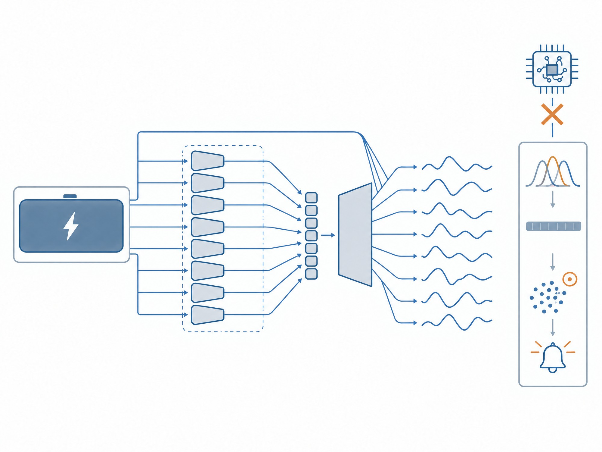
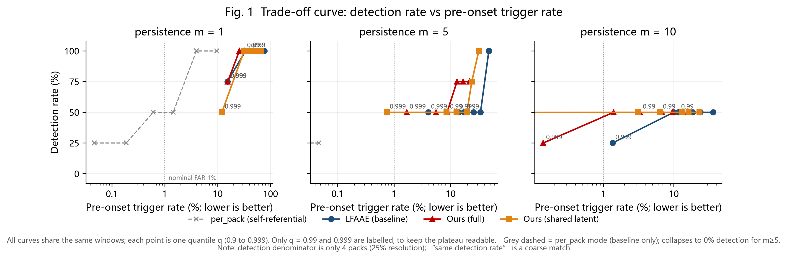
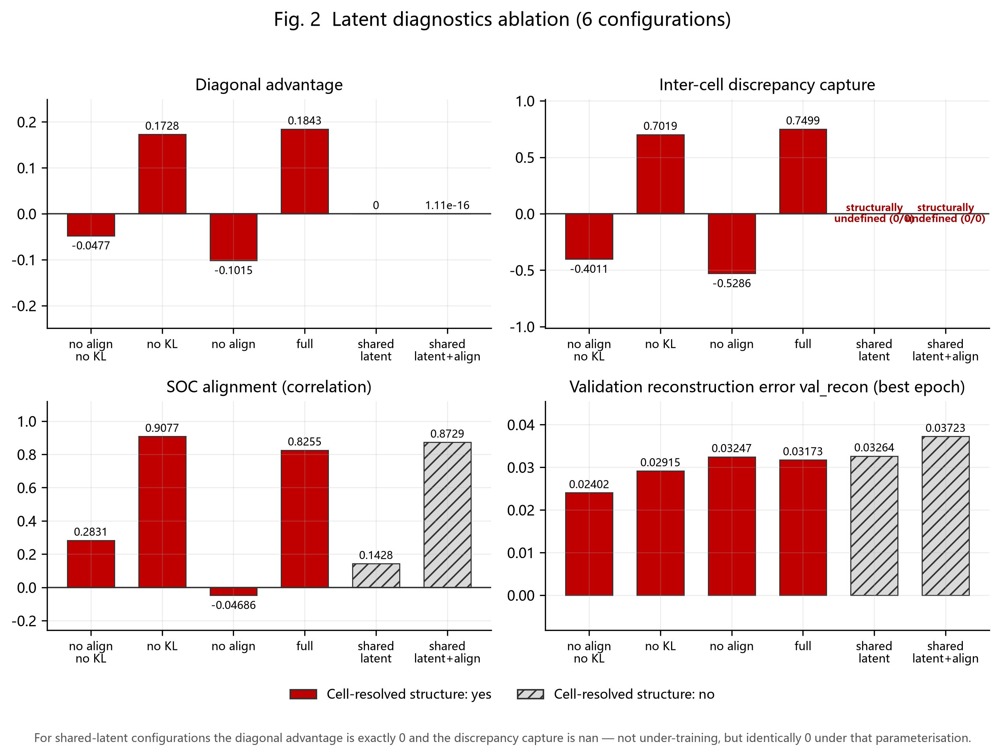
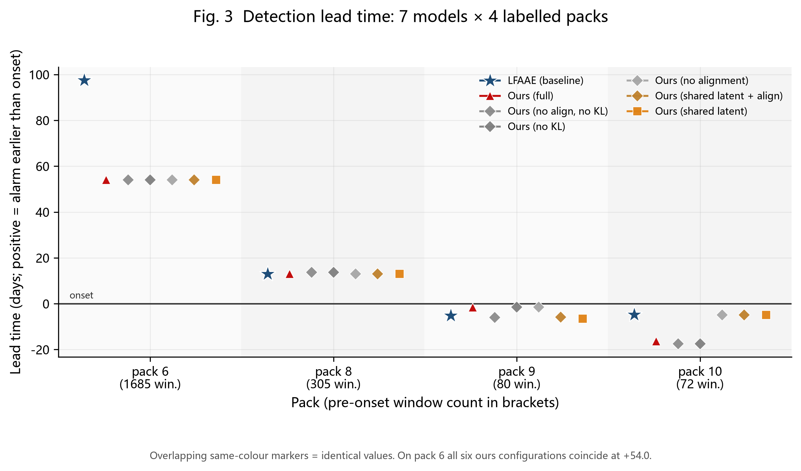
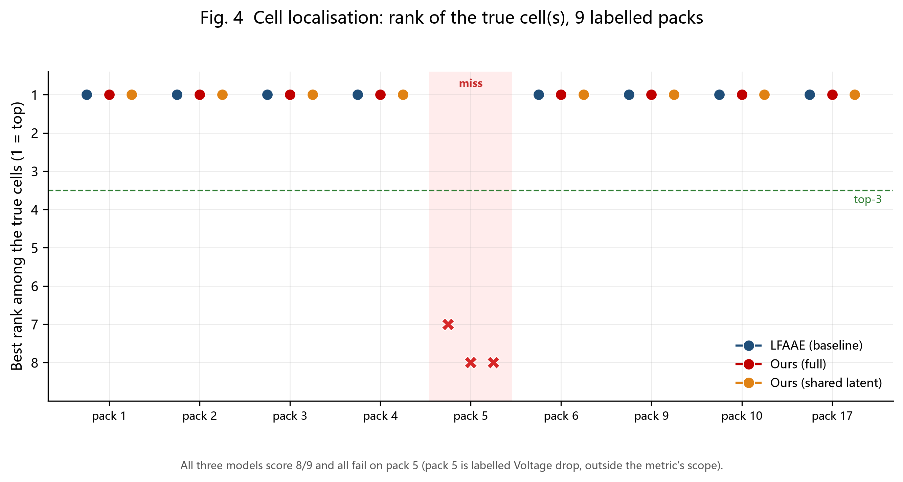
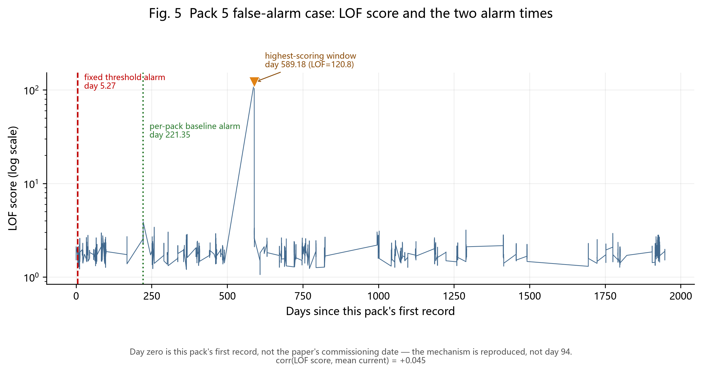
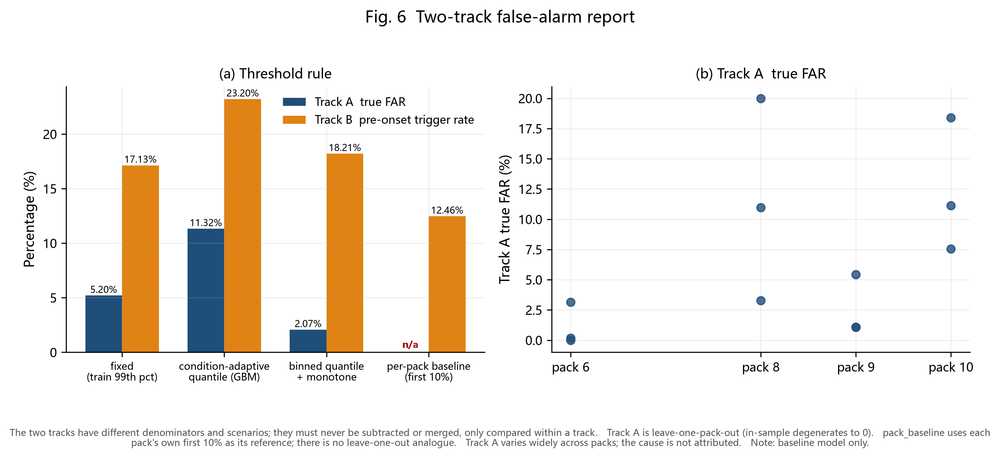

# pypack — 单体分辨潜变量对齐的电池包故障检测

---

## 摘要

### 1. 方法

**任务**：给定电池包的一段多通道时序窗口，判断该包是否已进入故障期、故障在哪个单体上、
以及能否在故障起点之前发出报警。

**输入**：每个窗口 `256 × 20` —— 256 个采样点，8 路单体电压（奇数列 1..15）、
8 路单体电流（偶数列 2..16）、4 路温度类（列 17..20）。

**模型**：单体分辨非对称自编码器。

- **8 个权重共享的单体编码分支**。槽位 `c` 只吃**单体 `c` 自己**的电压/电流/温度，
  看不到别的单体。单体间差异因此被**结构性**约束住，而不是指望网络自愿去区分。
- 编码得到「打包潜向量 + 逐单体潜向量集合」，解码器非对称，并接一路
  **电流直通支路**（`decoder_current_skip`）。电流是外生输入，编解码两端都可见；
  该支路对所有单体输出**同一个**共享分量，单体特有偏差无法被它吸收，仍必须走潜变量。
- **损失**：`L_total = λ₁·L_recon + λ₂·L_late + λ₃·L_reg`。
  `L_late` 是物理对齐项 —— 把单体 `c` 的潜变量对齐到单体 `c` 的**欧姆内阻**；
  `L_reg` 是 KL 项。
- **解码器的电流直通支路**（`decoder_current_skip`，见
  [`batfd/models/cell_ae.py`](batfd/models/cell_ae.py) 与
  [`configs/base.yaml`](configs/base.yaml)，默认开启）：电压波形主要由电流波形
  驱动，而电流被压成一个全局向量后，解码器要从该向量重塑出 256 步时序形状。
  电流是外生输入、编解码两端都可见，因此把它直接旁路给解码器。
  **关键约束**：该支路对所有单体输出**同一个**共享分量，单体特有偏差无法被它吸收，
  仍必须走潜变量 —— 否则单胞故障会被直通分量抹平。
- **重建能力（实测，可复核）**：六个消融配置在各自 `val_loss` 最优 epoch
  （即实际保存的权重）处的 `val_recon` 落在 **0.0240 ～ 0.0372**，
  来源 `outputs/runs/ours_<config>/history.csv`。重建最好的是 `no_late_no_kl`
  （0.0240），即**对齐项与 KL 项都为 0** 的配置；完整配置 `full` 为 0.0317，
  比它高 32% —— 这是对齐与 KL 两项换来的代价，属设计内取舍。

> ⚠ **一处需要交代的历史问题**：`configs/base.yaml` 的 `decoder_current_skip`
> 注释原先声称该支路「已实测证明必要」，并给出三行对照（0.175 / 0.152 / 0.0288，
> 称「改善 6 倍」「容量加 4 倍只改善 13%」）。**这三行不构成同口径对照，本 README
> 不引用**：三个数本身都能在 `outputs/runs/*/history.csv` 里查到，但它们分属
> **三个不同的消融配置**，且**混用了 `val_loss` 与 `val_recon` 两列** ——
> 0.17521 是 `ours_no_kl` ep35 的 `val_loss`（该配置真实的 `val_recon` 在其
> 最优 epoch 是 0.02915）；0.15266 出现两次，分别是 `ours_no_kl` ep48 的
> `val_loss` 与 `ours_no_late` **ep3**（远未收敛）的 `val_recon`；0.02881 是
> `ours_no_late_no_kl` ep60 —— 该配置 λ₂=λ₃=0，两列逐行恒等，故同值。
> **没有任何配置的 `val_recon` 接近 0.175**。同一处还称 `no_late_no_kl` 在
> ep38 的 `val_rec = 0.599`，而该配置**全表没有任何值落在 0.59～0.61**，
> ep38 的 `val_recon` 实为 **0.0341**。
> 因此**该支路是否必要尚无对照实验支持**；设计理由（电流是外生输入、编解码两端
> 可见；支路对所有单体输出同一分量，单胞故障无法被它吸收）成立，但「必要」这一步
> 待重跑对照后才能定。

**检测链**：论文 §2.3 的三个指标（余弦相似度、Q3 重建误差、电压偏差）→
24 维特征 → LOF 离群打分 → 持久性规则（连续 `m` 个窗口越限才算确认报警）。



> **左半，自左向右**：单体电压/电流/温度窗口 → 虚线框内 **8 路权重共享**的单体编码器
> （槽位 `c` 只看单体 `c` 自己；虚线框表示这 8 路共享权重）→ 8 个单体潜向量 + 1 路
> 打包潜向量 → 非对称解码器（其上方的旁路连线表示**电流直通支路**
> `decoder_current_skip`）→ 8 路重建波形。
>
> **右栏，自上而下即检测链**：重建残差 → 分数分布 → 24 维特征向量 → LOF 离群打分
> （**橙圈 = 越限窗口**）→ 报警。
>
> **右上角打叉的芯片**：内阻 / 故障起点标签支路，**刻意不与检测器相连** —— 起点标签
> 只用于事后评估，检测器全程不接触 `Hiddall`，以此排除循环论证。
>
> 本图为**示意**，只用来说明结构与数据流向，**不含任何实验数值**；含数值的结果图
> 见 §4 —— 那六张才由 `scripts/10_figures.py` 读 `outputs/tables/*.csv` 生成。

**阈值四口径**：`fixed`（论文原文规则：训练集分数 99 分位）、
`quantile_regression`（工况条件分位数）、`binned_quantile`（工况分箱+单调平滑）、
`pack_baseline`（逐包自身基线标准化）。另有 LOF 的 `train_novelty` /
`per_pack` 两种模式。

### 2. 创新点 —— 四条轴

论文的四个缺口在表中逐条给出章节/表号定位（手稿本身不在本仓库内），对应四条轴：

| 轴 | 缺口 | 做法 | 结果 |
|---|---|---|---|
| **① 单体分辨潜变量对齐** | 论文 §4.2 自称潜变量 *"fails to capture the inter-cell discrepancies"*，却从未指明哪个潜变量对应哪个单体 | 8 个**权重共享**编码分支，槽位 `c` 只吃单体 `c` 的信号，再对齐到单体 `c` 的内阻。附定量诊断（互相关矩阵 + 差异捕获度） | **机制成立，下游零收益**。诊断上确凿（见 3.1），但检测无增益、定位打平（见 3.2） |
| **② 物理派生起点标签 + 可证伪协议** | 论文唯一质量指标是「第几天报警」，无故障起点真值、无虚警率、无 ROC/F1；一个无限敏感的检测器在第 0 天报警就拿第一 | 从 `Hiddall` 的逐单体欧姆内阻派生故障起点，从而能报 lead time / 检出率 / **虚警率** / 单体定位 | 成立。4 个包有起点标签，其中 **3 个精确落在论文 Table 5 标注的单体上** |
| **③ 工况/基线自适应阈值** | 论文写死「99 分位」，且该选择本身没有任何消融支撑 | 判据从「分数 > 固定分位」改成条件分位数 / 逐包自身基线 | 部分成立。**工况条件阈值反而更差**（23.2% vs 17.1%），因为失效根源不是工况漂移而是**参照系错了** |
| **④ 验证规模扩大** | 论文用 8 个包 | 手上 14 个包（多出 pack 1/3/4/17–21，覆盖论文 8 包没有的故障类型） | 成立，但只有 4 个包带 `Hiddall`/起点标签 |

**这里有一条贯穿全文的原则**：轴①的收益必须在**下游任务**上兑现才算数。
潜变量诊断好看不等于方法更优 —— 4.3 与 3.2 记录的正是这条原则推翻了我自己的中间结论。

### 3. 结果

#### 3.1 成立的正向结果

**（a）论文自认失败的项，我们给出了它失败的结构性原因。**

论文 §4.2 / 图 7(b) 说潜变量抓不住单体间差异。实测（`ablation_latent_diag.csv`）
不只是重复这一现象，而是定位了原因 —— **共享潜向量的参数化下，该量恒为 0**：

| 配置 | 单体分辨 | λ₂ | λ₃ | 对角优势 | 差异捕获度 | `val_recon` |
|---|---|---|---|---|---|---|
| `no_late_no_kl` | 是 | 0 | 0 | −0.0477 | −0.4011 | 0.02402 |
| `no_kl` | 是 | 0.1 | 0 | **+0.1728** | +0.7019 | 0.02915 |
| `no_late` | 是 | 0 | 1e-3 | −0.1015 | −0.5286 | 0.03247 |
| `full` | 是 | 0.1 | 1e-3 | **+0.1843** | **+0.7499** | 0.03173 |
| `shared_latent` | **否** | 0 | 0 | **0.0000** | **nan** | 0.03264 |
| `shared_latent_late` | **否** | 0.1 | 0 | **1.1e-16** | **nan** | 0.03723 |

两个 `shared_latent` 配置的互相关矩阵 8 行**完全相同**，`a_cell` 逐单体恒等，
减去同窗口跨单体均值后恒为 0，相关系数分母为 0 —— 差异捕获度是
**nan（0/0，无定义）**，不是「低」；对角优势恰为 0（`1.1e-16` 是浮点残差）。
**失败是结构性的，不是训练不充分。**

**（b）光有单体分辨结构不够，必须同时有对齐损失。** 这是论文缺的 2×2 隔离 ——
把「单体分辨结构本身」和「物理对齐」的贡献分开：`cell_resolved=True` 但 λ₂=0 时
对角优势为**负**（−0.0477、−0.1015）；只有 λ₂=0.1 时才转正（+0.1728、+0.1843）。

**（c）对齐的代价可控。** `val_recon` 由 0.02402 升至 0.02915–0.03723
（**+21% ～ +55%**），不是数量级退化。

> ⚠ 比较重建能力**必须看 `val_recon`，不能看 `val_loss`**。后者含 `λ₂·val_late` 项，
> `full` 的 `val_loss` 0.1375 里有 0.0902 来自对齐项，照 `val_loss` 读会误判成
> 「重建退化 5.7 倍」——那正是我画第一版图 2 时犯的错。

**（d）阈值校准的泛化确实更好。** 名义虚警率是 1%（阈值取自训练集 99 分位），
基线实测 **17.13%**、本方法 **8.68%**。扫过整条权衡曲线，在
**15 个检出率相同的可比点**里，`ours_full` 触发率更低的有 **14 个**
（唯一例外 q=0.999/m=1：15.31% vs 15.55%，实际打平）。
**中位提前窗没有变短**，所以这不是靠晚报警换来的低虚警。

**（e）论文写死的「99 分位」本身留下约 4 倍改进空间。** q=0.99/m=5 是
50% 检出 / 17.13% 触发；收紧到 **q=0.999/m=5，检出率同为 50%，
起点前触发率降到 4.01%**。漏检的始终是 pack 9、pack 10（它们的起点前只有
80 / 72 个窗口，数据本身不给提前量），两个分位下都没检出 ——
所以这不是「用检出换虚警」，是纯改进。

**（f）论文阈值在未见包上结构性失效（已量化）。** 训练集自身的越限率是 1.0%
（定义如此），但在没见过的包上，基线在
**pack 17/18/21 第 0.1 天、pack 4 第 2.8 天、pack 2 第 3.3 天、pack 5 第 5.3 天**
就确认报警（`outputs/logs/p5_lfaae_all.log`）。对照论文 Table 4，
论文本方法在 pack 2 是第 **459** 天、pack 5 是第 **316** 天。

**（g）单体定位。** 9 个可标注包上，基线 `lfaae` 在四种「聚合口径 × 变体」组合下
**一律 top-1 命中 88.9%、top-3 命中 88.9%**（8/9）。唯一失手是 pack 5
（真值单体 5 排第 7）—— pack 5 标的是 **Voltage drop**，而论文 §2.3 的三个指标
全是电压类，属口径外限制、不是代码缺陷。**这一条必须声明，否则 88.9% 会被读成全覆盖。**

#### 3.2 如实呈现的负向结果 —— 轴①在下游任务上没有兑现

**（a）检测能力零增益。** 用新模型重跑 `fixed` 阈值（论文原文规则）+ m=5，
在 test1 的 4 个有起点标签的包上，所有模型跑同一批窗口：

| 模型 | p6 提前 | p8 提前 | p9 提前 | p10 提前 | 提前检出 | 起点前触发率 |
|---|---|---|---|---|---|---|
| `lfaae`（基线） | **+97.5** | +13.0 | −5.1 | −4.8 | 2/4 | 17.13% |
| `ours_full` | +54.0 | +13.0 | −1.5 | −16.4 | 2/4 | **8.68%** |
| `ours_no_late_no_kl` | +54.0 | +13.7 | −5.9 | −17.4 | 2/4 | 8.78% |
| `ours_no_kl` | +54.0 | +13.7 | −1.5 | −17.4 | 2/4 | 9.62% |
| `ours_no_late` | +54.0 | +13.0 | −1.5 | −4.8 | 2/4 | 9.06% |
| `ours_shared_latent_late` | +54.0 | +13.0 | −5.9 | −4.8 | 2/4 | 10.92% |
| `ours_shared_latent` | +54.0 | +13.0 | −6.5 | −4.8 | 2/4 | 12.75% |

（单位：天，正值 = 报警早于起点。起点前窗口数：p6=1685、p8=305、p9=80、p10=72。
来源：`outputs/tables/detection_*_train_novelty_*.csv` 的 `lead_days` 列
（口径为 `onset_day` − `alarm_day`，7 张表共 107 行逐行自洽），
阈值口径 `fixed` + 持久性 m=5。）

**七个模型一律 2/4 提前检出，且在这两包上的提前量完全一样。** pack 9 / pack 10
的起点分别在第 3.0 / 9.9 天，起点前只有 80 / 72 个窗口 —— 这两个包上「提前检出」
几乎没有可操作空间，不是模型不行。

**（b）pack 6 的提前量反而显著变差。** 基线 +97.5 天，全部 6 个 ours 配置一律
+54.0 天，**差 43.5 天**。七个 ours 配置在 p6 上完全一致，说明这是**架构层面**
的差异，不是消融项造成的。

**（c）触发率的收益主要不来自轴①。** 17.13% → 8.68%～12.75%。
`ours_shared_latent`（**没有**单体分辨结构，对角优势 1.1e-16）拿到 12.75% ——
基线到 `ours_full` 那 8.45 个百分点里，**4.38 个百分点（约 52%）由无单体分辨的
版本拿到**。逐点比 `ours_full` vs `ours_shared_latent`（14 个同检出率点）：
**13 个点 `ours_full` 更低，唯 q=0.999/m=5 被反超**（1.68% vs 0.75%）。
那 13 个胜点的触发率差落在 **1.73 ～ 9.57 个百分点**（中位 **6.21**）。
所以准确表述是：**轴①的边际贡献存在但不稳 —— 幅度中位约 6 个百分点、
跨度近 5.5 倍，且在最紧的那个操作点上直接反转**，不足以支撑
「轴①是主要贡献」的叙述。

**（d）定位完全打平。**

| 模型 | top-1 | top-3 | 失手的包 |
|---|---|---|---|
| `lfaae`（基线） | 8/9 = 88.9% | 8/9 = 88.9% | pack 5 |
| `ours_full` | 8/9 = 88.9% | 8/9 = 88.9% | pack 5 |
| `ours_shared_latent` | 8/9 = 88.9% | 8/9 = 88.9% | pack 5 |

三者四个组合一律 88.9%，且**在同一个包上失手**。

**（e）结论。** 潜变量诊断上轴①的差异是确凿的（对角优势 +0.1843 vs 1.1e-16），
但这份分离**没有转化为任何下游指标** —— 检测无增益、定位打平，两根下游支柱
都指向同一结论。**因此那 6 行消融只能作为「机制成立」的证据，不能拿去支撑
「方法更优」。** 这条必须在报告中如实写，不能拿诊断结果冒充方法优势。

> **两个削弱可比性的因素，引用检测/权衡结果时必须一并声明：**
> ① 检出率只有 **4 个包**做分母，分辨率 **25%**（1/4），「同检出率」是粗匹配 ——
> 同为 50% 的两个模型可能检出的不是同一批包；
> ② 因此「同检出率下比触发率」只是近似，不是严格的 ROC 配对比较。

#### 3.3 中途出现并被推翻的结论

记录在此以免重复犯错。每行都写明推翻它所用的产物或判据。

| 曾得出的结论 | 实测推翻 | 根因 |
|---|---|---|
| `per_pack` 模式**大幅优于** `train_novelty` | **伪结果**。`per_pack` 在 m≥5 上全线 0% 检出 | `08_tradeoff.py` 的 `per_pack` 分支丢弃了 `score_self_referential` 返回的 `.threshold`，触发率被压到近 0；且把整个数据集当成一个块，而非逐包 |
| 8 路电流「逐位相同、可判为冗余」 | **错**。test2 中约 15% 窗口存在差异，最大约 1.6–2.9 A | 旧诊断用了**抽样**（4200/21013）。消融项「去冗余电流通道」据此取消 |
| 时间轴非单调 | **错**，是**跨 ID 块**的假象；ID 内严格单调（14 个 ID 全部 `negative-steps = 0`） | 旧诊断只看全局单调性 |
| 论文 §4.2 与附录 Table 5 矛盾 | **论文自洽**，是转写件右列整体错位约 3 行 | 已按 PDF 第 20 页原文逐项订正，机读版 `configs/fault_table.yaml` |
| `no_late_no_kl` 诊断为「对角优势 −0.025、差异捕获 −0.497」 | 这两个数字在全部运行产物中**查无出处** | 已按正式结果 −0.0477 / −0.4011 替换 |
| `per_pack` 的「检出」是检出力 | **构造使然**。中位报警窗落在随机越限首位的几何期望 `1/(1−q)` **附近，但只在平台区成立**：q=0.90/0.95/0.975 的实测/期望比值为 0.70/0.95/1.05；q=0.99/0.995/0.999 发散到 1.42/0.32/1.65，且检出包数随之降到 1–2 个，中位数由极少数包决定、本身已不稳健 | `per_pack` 的阈值取自该包自身序列，按构造必有约 `(1−q)` 的窗口越限 |

**`per_pack` 模式的正确用法与失效方向**：它只在 m=1 上「有效」，而那是构造使然；
m≥5 上缓慢退化让整包一起漂移、自参照密度变化很小，真异常被钝化漏检 ——
**可用的权衡曲线只在 m≥5 的 `train_novelty` 上**。

#### 3.4 pack 5 高电流误报案例（复现论文自己举的反例）

论文用 pack 5 的高电流脉冲误报批评 GDI 基线，本项问同一问题，但对象换成
**论文自己的固定阈值**：

| 口径 | 报警日（距本包首条记录） |
|---|---|
| 固定阈值（训练集 0.99 分位 = 1.6221） | 第 **5.27** 天 |
| `pack_baseline`（训练集 z 的 0.99 分位 = 2.8656） | 第 **221.35** 天 |

`pack_baseline` 把报警推迟了 **216.1 天**。

**但机制与「高电流」不完全对得上，这一点必须如实写：**

- 第 5.27 天那个确认报警由下标 1–5 共 **5 个连续越限窗口**凑出（持久性 m=5），
  但**其中只有后两个是满放电脉冲** —— 第 5.26、5.27 天，`disch_frac = 1.00`，
  p95 电流 63.0 / 46.3 A。**前三个不是**：第 0.01、0.03、5.20 天的 p95 电流
  只有 8.5 / 7.6 / 2.1 A。所以「固定阈值被高电流脉冲打穿」这个说法
  **只对了一半** —— 高电流窗口是这段越限的**结尾**，不是起因。
  `pack_baseline` 把这批越限压了回去，报警推迟到第 221.35 天。
- 然而**分数最高的窗口更不是高电流窗口**：第 589.18 天 LOF 分 **120.834**，
  为第二名的 **9.47** 倍，而它的 `mean_abs_i` 只有 7.32、`disch_frac = 0.00` ——
  它落在训练分布的**稀疏区**，与电流大小无关。
- `corr(LOF 分数, 平均电流)`：pack 5 内 **+0.045**，整个 test2 **+0.021**。

所以正确表述是：论文的固定阈值在 pack 5 上的误报，**不是**「电流大 ⇒ 分数高」的
单调效应，而是**工况落在训练分布稀疏区、LOF 距离整体抬高**所致；高电流脉冲只是
恰好也属于稀疏工况的一种。**这一条必须与「`pack_baseline` 解决了误报」的简化说法
分开陈述。**

⚠ **口径声明**：论文说的「第 94 天」从**投运日**算起；我们的数据没有投运日期，
只能用「距本包首条记录的天数」。**两者不是同一个零点**，因此不能声称复现了论文的
绝对第 94 天，只复现**机制**。

### 4. 图表

六张图。`scripts/10_figures.py` 一次生成中英双版、PNG（300 dpi）+ PDF（矢量，
字体按 Elsevier 要求嵌入为 TrueType），且**只读所选实验的表格、不重算任何指标**。
本节展示的是历史产物，来源为 `outputs/tables/*.csv`；新结果使用下文的实验 ID 选择。

**本仓库只随附英文 PNG**（本节下图六张，另有图 0 一张，见 1 节）。中文版与投稿用的矢量 PDF 未随仓库发布，
显式运行 `python scripts/10_figures.py --allow-legacy` 可基于历史表重新生成中英双版 PNG/PDF，
结果写入独立选择目录，不覆盖本节随附图片。

本节只讲这六张**结果图**。另有 **图 0（方法总览）** 是手绘示意、**不由 `10_figures.py`
生成、也不含任何实验数值**，见图 1 节。

| 图 | 内容 | 它证明什么 | 它**不能**证明什么 |
|---|---|---|---|
| 1 | **权衡曲线**：检出率 vs 起点前触发率，3 个持久性 × 6 个分位，含 `per_pack` 对照 | 阈值取 99 分位本身留下约 4 倍改进空间；`per_pack` 在 m≥5 上塌到 0% | 不是严格 ROC 配对比较（检出率分母只有 4 包） |
| 2 | **潜变量诊断消融**（6 配置 × 4 面板） | 轴①的机制成立：完整配置对角优势 **+0.1843**；两个共享潜向量配置恒为 0（`shared_latent` 恰为 0.0，`shared_latent_late` 为 1.1e-16 浮点残差 —— 二者的 `diag_mean` 与 `offdiag_mean` 完全相同），其差异捕获度为 **nan(0/0)**，失败是结构性的 | 不能支撑「方法更优」——诊断分得开 ≠ 下游有用 |
| 3 | **检测提前量**：7 模型 × 4 有标签包 | 七个模型在 p6/p8 上完全重合，检测零增益；p9/p10 数据本身不给提前量 | 4 个包分辨率 25%，不能外推到 14 个包 |
| 4 | **单体定位名次**：9 个可标注包 | 三模型一律 8/9，且在同一包（pack 5）失手 | 不衡量多单体召回（`hit_at_k` 口径是「最佳真值单体的名次」） |
| 5 | **pack 5 案例时间线**：LOF 分数 + 两个阈值的报警时刻 | 固定阈值在第 5.27 天确认报警，该报警由 **5 个连续越限窗口**凑出，其中**只有后两个是满放电脉冲**（p95 电流 63.0 / 46.3 A），前三个 p95 仅 8.5 / 7.6 / 2.1 A；逐包基线把这批越限压回，推迟到第 221.35 天 | 不能声称复现论文的第 94 天（零点不同）；且分数最高的窗口不是高电流窗口 |
| 6 | **双轨虚警报告**：轨 A 真虚警率 / 轨 B 起点前触发率 | 两轨分母与场景不同，**绝不可相减或合并**；轨 A 必须逐包留一 | 轨 A 的包间离散原因**尚未归因**（见 6. 局限末条） |








图中标注的**时间零点一律是「本包首条记录」**，不是投运日（见 6. 局限）。
六张图的脚注均为对外的正文措辞，不含内部文档引用。

---

## 配置方法

### 1. 环境

```bash
bash scripts/setup_env.sh 2>&1 | tee outputs/logs/setup.log
conda activate batfd
```

已实测：Python 3.12.14 / torch 2.14.0+cu126 / CUDA 可用 / RTX 4060 Laptop 8 GB /
scikit-learn 1.9.1 / numpy 2.5.2 / scipy 1.18.1。

**两条固定写法**（否则脚本在这台机器上跑不起来）：

```bash
# (a) 不要用 conda run -n batfd python —— 在这台机器上会失败。
#     先 conda activate batfd，之后直接用 python；要显式指定解释器就用 $CONDA_PREFIX
conda activate batfd
python scripts/05_detect.py --model lfaae --tag lfaae
# 等价："$CONDA_PREFIX/python.exe" scripts/05_detect.py --model lfaae --tag lfaae

# (b) 内联脚本要自己加 PYTHONIOENCODING —— console.setup() 只在入口脚本里执行
PYTHONIOENCODING=utf-8 python - <<'PY'
...
PY
```

> **显存与内存提示**：本机总内存 15.8 GiB，同时开着 MATLAB（约 2.8 GB）与
> VS Code 时可用常低于 2.5 GiB。`load_raw` 因此提供分块写 memmap 的路径 ——
> 整块转置会因峰值叠加被 OOM kill（**实测发生过**）。跑大文件前先释放内存。

控制台默认 GBK，中文会乱码、且 `.mat` 文件头里的非 GBK 字节会直接抛
`UnicodeEncodeError` 打断脚本。`batfd/console.py::setup()` 在每个入口脚本第一件事
执行，强制 stdout/stderr 为 UTF-8。

### 2. 数据

> **四个 `.mat` 不在本仓库内。** 它们合计 790 MB，且实测 **gzip 比率 1.00 ～ 1.01
> （不可压缩）**，单文件最大 347 MB，超出 GitHub 单文件 100 MB 的上限。
> 需要数据请联系 **youaweyk@outlook.com**。

拿到后放到**仓库根目录下的 `data/`**（即 `pypack/data/`，对应 `configs/base.yaml` 的
`data_dir: "data"`；该目录已列在 `.gitignore` 内、不会被提交，要放别处就改这一行）。
四个文件（**MATLAB v5，非 v7.3** → 只能用 `scipy.io`，`h5py` 读不了）：

| 文件 | 形状 | ID | 时间 | Hiddall |
|---|---|---|---|---|
| StandTrainData.mat | (256, 20, 26508) | 6,8,9,10 | 无 | 有 |
| StandTestData1.mat | (256, 20, 8110) | 6,8,9,10 | 有 | 有 |
| StandTestData2.mat | (256, 20, 21013) | 1,2,3,4,5 | 有 | 无 |
| StandTestData3.mat | (256, 20, 40093) | 17–21 | 有 | 无 |

- 通道：奇数列 1..15 = 8 路单体电压；偶数列 2..16 = 8 路电流；列 17..20 = 4 路温度类。
- **8 路电流并非完全相同**：test2 中约 15% 的窗口存在差异，最大约 1.6–2.9 A。
  这正是论文所说的「总电流 + 各单体均衡电流」。
- `Hiddall` = `[SOC, R₁…R₈]`，内阻单位 mΩ。依据：论文 §4.2 明说 model-derived states
  是 SOC + ohmic resistance，Fig 6 纵轴 "Resistance (mΩ)" 量程 0–2 mΩ，
  而实测范围 0.06–2.1。**这是高置信推断，不是文档事实** ——
  数据包内没有任何说明文档。
- **ID = 论文的包编号**。证据：ID=3 跨度 **126.7 天**（论文称 pack 3 仅运行三个月）；
  ID=5 跨度 **1947.5 天**（论文称 pack 5 约五年）。
- **论文 test dataset 2 所需的 pack 12、14 不在数据中**；全部 ID 并集 = 14 个包。
  数据截止 2019-11，论文称到 2022-03，因此手上是论文数据的**子集**。

#### 两个必须知道的坑

1. **`scipy.io.whosmat` 在 StandTestData1.mat 上会崩**
   （`TypeError: 'NoneType' object is not iterable`）。该文件本身合法，
   `loadmat` 与 MATLAB 都能读，是 scipy 的实现缺陷。`mat_io.whosmat` 已加回退路径，
   并用 `last_whosmat_method()` 留痕，不静默掩盖。
2. **`ThisTimeSlot` 是 MATLAB `datetime`（MCOS 对象），scipy 读不出来**，
   只给出 `MatlabOpaque(_Class='datetime')`。因此用
   `scripts/matlab_export_time.m` 让 MATLAB 一次性导出成 datenum。
   该脚本刻意写成**纯 ASCII** —— 本机 MATLAB 按 GBK 解析 `.m`，
   含中文注释的 UTF-8 文件会解析失败。

### 3. 复现步骤

`scripts/matlab_export_time.m` 需在 P1 **之前**用 MATLAB 跑一次（见上）。

```bash
conda activate batfd
cd pypack                  # 仓库根目录；以下脚本一律相对它运行

python scripts/00_env_check.py      # P0 环境自检 + 数据读取通路验证
python scripts/01_preprocess.py     # P1 转缓存（26 项校验，逐项对照 MATLAB 侧诊断）
python scripts/02_verify_labels.py  # P2 通道-单体映射验证 + 故障起点标签
python scripts/03_train_baseline.py # P3 论文基线 LFAAE（300 ep / 1259.4 s）
python scripts/04_train_ours.py --smoke       # P4 冒烟自检
python scripts/04_train_ours.py               # P4 六组消融 + 潜变量诊断（约 2h11m）
python scripts/05_detect.py --model lfaae --tag lfaae          # P5 基线检测
python scripts/05_detect.py --model ours  --tag ours_full      # P5 本方法检测
python scripts/06_far_dualtrack.py  # P6 双轨虚警报告
python scripts/07_localize.py       # P7 单体定位评估
python scripts/08_tradeoff.py       # P8 权衡曲线
python scripts/09_pack5_case.py     # P9 pack 5 案例（同时导出画图用的全序列）
python scripts/10_figures.py --experiment-ids 实际实验ID  # P10 使用 P5–P9 打印的实验 ID
```

各阶段实测耗时见上（P3 1259.4 s、P4 约 2h11m），产物落在 `outputs/` 对应子目录
（`cache/` `runs/` `tables/` `experiments/` `figures/` `logs/`）。

`10_figures.py` 支持 `--only 1 3`（只画指定编号）、`--langs zh`、`--no-pdf`。
数据缺失的图会**跳过并打印原因**，不会画一张空图；运行后检查选择清单中的 `skipped`，
不能仅凭退出码认定所有图已生成。

#### 实验可信度升级（2026-09-29）

本次只改缓存、产物来源及评估字段，**不改变模型/训练切分/阈值算法，不重训，也不改写历史实验数值**。
已有 checkpoint 可以继续使用；升级后的下游步骤必须先重跑 P5，再运行 P6–P9。

- **缓存失效**：重建校验 checkpoint、实际模型状态、输入信号/ID、关键配置与实现内容；
  指标校验实际重建内容与代次。使用分块 SHA-256，而非仅凭路径、时间或文件大小。
  旧缓存没有清单时首次重算；损坏或过期缓存不得静默读取。
  `--force-recon` 同时使指标重新计算。内容哈希增加顺序 I/O，**同一 tag 不支持并发写缓存**。
- **实验身份**：P5–P9 打印实验 ID；相同权重、有效配置、数据/标签、代码及运行库版本归入同一实验。
  修改源码内容会改变实验 ID，Git commit 只用于审计。更换 tag 下的权重也不会冒用旧实验。
- **独立产物**：新表写入 `outputs/experiments/<实验ID>/tables/<阶段>_<产物ID>.csv`；
  同目录 JSON 校验表格字节、参数、实验身份与缓存快照。参数、结果或重建代次改变会生成新产物，
  不覆盖旧表。`experiment.json` 保存实验输入清单；历史表仍保留在 `outputs/tables/`。
- **明确出图来源**：P10 必须选择 `--experiment-ids ID [ID ...]` 或 `--allow-legacy`，二者互斥。
  同一实验有多份相同口径产物时，用 `--artifact-ids ID [ID ...]` 明确选择，不自动挑“最新”。
  新图与 `selection.json` 位于 `outputs/figures/selections/<选择ID>/`，不会改写历史图片。
  历史模式明确不保证来源可核验，不与新实验混用。P4 消融表尚未迁入可核验产物链，
  **图 2 暂时只在显式历史模式中读取**。

以下命令中的 ID 需替换为实际输出；产物 ID 也在 CSV/同名 JSON 中记录：

```bash
python scripts/10_figures.py --experiment-ids 实际实验ID --only 6 --langs en --no-pdf
python scripts/10_figures.py --experiment-ids 实际实验ID --artifact-ids 实际产物ID --only 6
python scripts/10_figures.py --allow-legacy --only 2
python -X utf8 -B -m unittest discover -s tests -v
```

回归测试不读取真实训练数据或权重；端到端冒烟使用临时目录、合成数组及随机初始化的真实 LFAAE，
跑通 P5–P10，不训练、不把合成数值当作研究结果。分步记录见
[实施日志](docs/changes/2026-09-29-experiment-integrity.md)。

**既有发布限制**：当前 `.gitignore` 的 `data/` 规则同时忽略 `batfd/data/`，本地存在的该源码包尚未纳入 Git。
本轮没有顺手改变忽略规则或提交这些既有文件，因此测试通过仅说明当前工作区可运行，
**不代表干净克隆已能复现**；发布前应单独修正并验证。

### 4. 目录

```
pypack/
  configs/base.yaml          全局配置（单一事实来源）
  configs/fault_table.yaml   论文 Appendix Table 5 的核实版（PDF 原文逐项订正）
  data/                      四个 Stand*.mat 的落点（790 MB，需自行索取；已 gitignore）
  batfd/
    config.py                配置加载
    provenance.py            内容指纹与缓存完整性清单
    experiments.py           实验 ID、独立产物与来源校验
    console.py               强制 UTF-8 输出
    progress.py              进度条（重定向到文件时自动关闭动画）
    robust.py                多估计量稳健尺度（应对重尾）
    data/
      mat_io.py              读 v5 .mat；字段名归一化；时间旁路解码
      cache.py               float32 memmap 缓存 + 元数据
      channels.py            通道语义、量纲换算（推断）、去冗余开关
      conditions.py          逐窗口工况协变量（**不含内阻**，防循环论证）
      dataset.py             窗口 Dataset + 按 ID 的时间顺序切分
    models/
      cell_ae.py             单体分辨非对称自编码器
      losses.py              L_recon / L_late / L_reg
      train.py               自定义训练循环
      inference.py           批量重建（带磁盘缓存）
    features/fault_metric.py 论文 §2.3 的三个指标
    features/cache.py        指标缓存依赖与代次校验
    detect/
      lof.py                 LOF 两种模式 + 持久性规则
      threshold.py           固定分位数 / 条件分位数阈值
    eval/
      onset.py               Tier A：内阻派生的故障起点 + 敏感性
      metrics.py             提前量 / 虚警率 / 单体定位
      latent_diag.py         潜变量-内阻诊断（轴①的证据）
      dualtrack.py           双轨虚警报告
    baselines/
      lfaae.py               论文方法（Table 1 忠实实现，含 stride 订正）
      doavi.py               占位 + 完整不实现理由 + 真实引文
    viz/                     六张结果图（style 负责字体/标签，plots 负责画）
  scripts/                   00 → 10 阶段入口脚本
  tests/                     标准库 unittest 回归与临时端到端冒烟
  outputs/                   cache / runs / tables / experiments / figures / logs
    experiments/<ID>/        experiment.json + 独立 tables/ 及产物清单
    figures/selections/<ID>/ 所选产物的新图 + selection.json
    figures/                 图 0 方法总览（手绘）+ 图 1..6 结果图，均为英文 PNG
```

### 5. 四条不可动摇的口径

1. **所有数字必须来自实际运行。** 不编造、不估算、不填占位值。未跑出来的留空
   并注明原因。
2. **循环性防护**：故障起点标签来自 `Hiddall` 内阻；**检测器永不接触 `Hiddall`**，
   只用电压/电流/温度的重建与偏差。工况协变量里**不含任何内阻**。
3. **论文未交代而必须自行决定的事项一律显式记录**，不假装照做：λ₁/λ₂/λ₃ 取值
   （论文未给）、LOF 输入是否标准化（论文未说）、激活函数与 BN（Table 1 未列）、
   「检测日」的持久性规则（论文未说明）。这些都在相应模块的 docstring 里写明，
   报告中必须同样声明。
4. **新输出明确区分“曾报警”和“提前检出”**：`alarm_ever` 表示出现过确认报警；
   `early_detected` 仅在确认报警严格早于有效起点时为 `True`，等于/晚于起点为 `False`，
   无有效起点为 `None`（CSV 空值）。`early_detection_rate` 的分母仅含有效起点标签。
   `trigger_rate_before_onset` 是起点前触发率，**不是轨 A 真虚警率**；两轨不得合并。
   旧 Python 属性 `detected` / `far_per_window` 仍可读取但会发出弃用警告，新 CSV 不导出它们。
   **历史表解释不变**：旧 `detection_*.csv` 的 `detected` 是“是否报过警”（含晚报警），
   旧权衡表 `detection_rate` 是“是否提前报警”。本文 3.2 的“提前检出 2/4”采用后者，
   同批历史检测表的 `detected` 为 **4/4**；不是矛盾，是口径不同。
   P10 仅在显式历史模式下兼容旧权衡列，引用历史检出率仍需写明出处与定义。

### 6. 已知且无法消除的局限

- **论文的绝对天数不可复现**（投运日期未知 + 数据是子集）。一律用相对天数
  （「距本包首条记录」），所有方法在同一批窗口上比较。
- **pack 12、14 缺失** → 论文 Table 4 只能做 pack 2、5 两行。
- **只有 pack 6/8/9/10 有 `Hiddall`**，因此**只有这 4 个包有故障起点时间标签**；
  其余 10 个包只能用于单体定位与虚警率统计。
- **检出率的分辨率只有 25%**（分母 4 个包），「同检出率」是粗匹配。
- **DOAVI 基线未实现**：具体公式（偏差角定义、SOC 分区方式、聚类算法、离散度
  量化、阈值确定）全部在付费全文里，公开来源只有概念描述。按项目规则
  **不编造方法细节**，因此留空。另有独立技术约束：DOAVI 依赖 SOC 分区，
  而数据中只有 4 个包带 SOC。见 `batfd/baselines/doavi.py`。
- **`pack_baseline` 没有轨 A（真虚警率）**：它的参照系是每个包自己的前 10%，
  每包自成一个参照系，**没有「留一」可言**；硬套留一只会拿无关的包当基线。
  由 `fit_and_score_leave_one_id` 显式抛 `ValueError` 拦截，
  而不是静默给一个数。
- **轨 A 的包间离散很大**（`quantile_regression`：pack 6 3.14%、pack 8 19.98%、
  pack 9 5.44%、pack 10 18.40%），**原因尚未归因** —— 留一口径下每个包用的是
  「其余三个包」拟合出的不同参照系，「跨包偏移」与「包自身工况差异」两类因素
  混在一起，要分清需要额外实验。此处只报数、不下结论。
