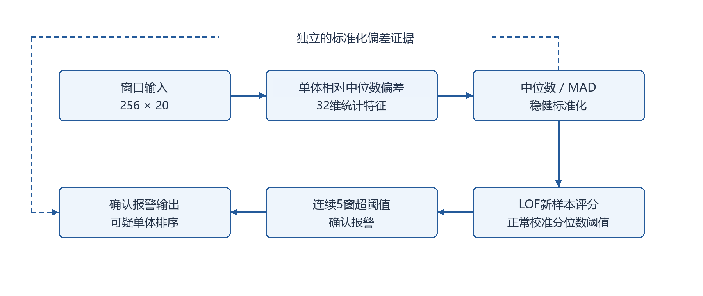
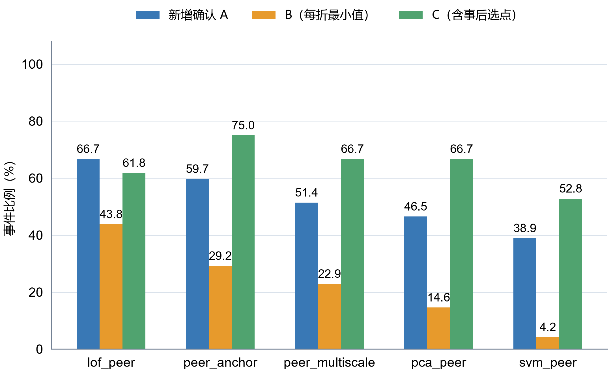
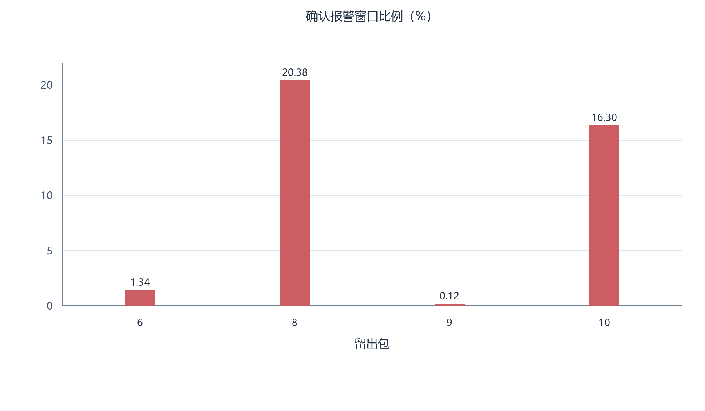

# 基于单体相对中位数偏差与局部离群因子的 电池包无监督故障检测：阶段研究报告

**日期：** 2026年10月7日

**摘要**

针对训练数据不包含故障、测试数据选取接近故障时间片段的电池包监测任务，本研究构建了基于正常数据建模与正常校准阈值判别的无监督检测流程。该流程首先提取八路单体信号相对于逐采样点中位数的偏差统计特征，经中位数绝对偏差稳健标准化后，使用局部离群因子进行新样本异常评分；正常校准阈值由独立于模型拟合行的正常校准数据确定，并以连续五个窗口超阈值作为报警确认条件。在四个电池包上的探索性按包留出实验中，第二轮比较了15种原始输入候选方法。基于人工偏移、漂移和噪声注入的开发实验，所选LOF候选的新增确认事件比例为66.7%，在预设候选排序加权分数下排名第一。然而，正常留出包8和包10的确认报警窗口比例分别为20.38%和16.30%，说明跨包泛化与阈值适配仍存在局限。上述注入结果不代表真实故障性能。三份近故障测试缓存已完成固定模型推理，共69216窗、14个包；按描述性时间缺口规则重置连续计数后，确认报警21568窗。该数量依赖连续性假设，尚无外部事件记录支持真实故障性能评价。

 **关键词：** 电池包；无监督故障检测；局部离群因子；稳健标准化；正常校准阈值

## 1 研究问题与任务定义

本研究采用数据提供方确认的任务前提：训练数据集不包含故障数据，测试数据集由接近故障的时间片段构成。目标是利用正常训练数据建立参考模型，识别测试窗口对正常模式的偏离，并输出可疑单体排序，辅助后续故障分析。

设第 $i$ 个输入窗口为 $\mathbf{V}_i\in\mathbb{R}^{T\times C}$ ，其中 $T=256$ 为窗口内采样点数， $C=8$ 为当前实现选取的单体通道数。检测器输出异常分数 $s_i$ 、单窗超阈值指示 $e_i$ 、确认报警指示 $a_i$ 及单体异常证据 $h_{i,c}$ 。异常分数与确认报警表示相对于正常参考的偏离，不能直接解释为故障概率或已证实的故障原因。

 **故障检测不要求故障发生后的每个数据点均被判为故障。** 在缺少逐窗故障标注时，不能将整个近故障片段或故障后的所有窗口直接标为阳性，也不能将其中所有未报警窗口均计为漏检。无监督建模不需要故障标签，但真实故障检出、预警提前量和故障单体定位的评价，仍需相应的外部事件记录、时间对应关系或单体确认信息。

## 2 数据与实验划分

### 2.1 数据规模与使用范围

四份缓存数据的规模及用途见表 1。当前代码从20列输入中选取第1、3、5、7、9、11、13、15列，按八路单体信号处理。其物理字段和单位尚需数据说明确认，本报告不据此报告毫伏量级或物理故障严重程度。

**表1 缓存数据规模与用途。形状依次为窗口数、采样点数和通道数。**

| 数据集 | 缓存形状 | 包编号 | 用途 |
| :---: | :---: | :---: | :---: |
| StandTrainData |  $26508\times256\times20$  | 6、8、9、10 | 正常模型拟合、阈值校准及开发集比较 |
| StandTestData1 |  $8110\times256\times20$  | 6、8、9、10 | 已完成近故障片段推理 |
| StandTestData2 |  $21013\times256\times20$  | 1--5 | 已完成近故障片段推理 |
| StandTestData3 |  $40093\times256\times20$  | 17--21 | 已完成近故障片段推理 |

### 2.2 拟合、校准与开发职责

开发集比较采用按包留一法交叉验证（leave-one-group-out cross-validation），以电池包为分组，形成四折[4,7]。每折留出一个完整包，将其余每个包按缓存行序划分为前60%拟合、中间20%阈值校准和末20%开发。开发部分用于人工扰动注入比较，留出包用于扩展扰动实验及正常序列分析。拟合、校准和开发行互不重合，但窗口是否共享原始采样点尚未确认，故不能据此宣称严格时间独立。四个包均已参与探索性分析，不属于全新盲测数据。

选型后，全局候选使用四包合计15903个窗口拟合、5301个窗口校准，剩余5304个窗口未参与此次拟合或校准。该全局重新拟合用于保存候选模型，不构成新增独立性能验证。

### 2.3 数据独立性与时间信息

StandTestData1中有43个完整窗口与训练缓存逐值相同，均对应包10。这些窗口已标记；第5.4节另报排除重复位置的统计，不能将整份数据视为完全独立测试集。其他测试集未发现完整重复窗口，也不意味着已经排除部分采样重叠。

测试缓存包含时间数组，训练缓存没有。窗口时间锚点、窗口步长及缺测断点处理尚需确认。每窗256个采样点不表示256秒；未确认时间对应关系前，窗口计数不能直接换算为分钟、小时或天。

## 3 检测方法

### 3.1 总体流程

当前主方案由相对中位数偏差特征、稳健标准化、局部离群因子（Local Outlier Factor，LOF）新样本异常评分、正常数据阈值校准及连续超阈值确认构成，整体流程见图 1。代码标识为`lof_peer`，仅为项目内简称，不表示新的原创算法。

**图1 当前无监督检测流程。实线表示整体评分与报警确认流程；单体排序使用独立的标准化偏差证据，不作LOF因果归因。正常拟合与校准阶段确定模型及阈值，测试阶段不更新参数。**

### 3.2 单体相对中位数偏差特征

对窗口 $i$ 内的采样点 $t$ ，计算八路信号的中位数参考及单体偏差：

$$
\begin{aligned}
b_{i,t} &= \operatorname{median}_{j=1,\ldots,C}v_{i,t,j}, \\
  r_{i,t,c} &= v_{i,t,c}-b_{i,t}.
\end{aligned}
$$

（1）

这里的偏差是单体信号与同一采样时刻所有单体中位数之差，属于本文定义的特征，不是已有算法名称。中位数计算包含当前单体，未预先筛选正常单体。对每路偏差提取四个特征：

$$
\mathbf{x}_{i,c}=
  \begin{bmatrix}
    \displaystyle\frac{1}{T}\sum_{t=1}^{T}r_{i,t,c} \\
    \operatorname{std}_{t=1,\ldots,T}(r_{i,t,c}) \\
    Q_{0.95}\!\left(\{|r_{i,t,c}|\}_{t=1}^{T}\right) \\
    \operatorname{std}_{t=2,\ldots,T}(r_{i,t,c}-r_{i,t-1,c})
  \end{bmatrix}.
$$

（2）

其中 $Q_q$ 表示经验 $q$ 分位数， $\operatorname{std}$ 采用与当前实现一致的总体标准差计算，即方差分母为参与计算的元素数。将八路特征依次拼接，得到 $\mathbf{x}_i\in\mathbb{R}^{32}$ 。相对表示用于突出单体间差异，但可能削弱多数单体共同变化的证据。

### 3.3 中位数绝对偏差稳健标准化

令 $\mathcal{F}$ 为正常拟合窗口索引集合。第 $k$ 维特征的中心 $m_k$ 和中位数绝对偏差 $d_k$ 仅由拟合数据计算：

$$
\begin{aligned}
m_k &= \operatorname{median}_{i\in\mathcal{F}}x_{i,k}, \\
  d_k &= \operatorname{median}_{i\in\mathcal{F}}|x_{i,k}-m_k|, \\
  z_{i,k} &= \frac{x_{i,k}-m_k}{\max(1.4826d_k,10^{-7})}.
\end{aligned}
$$

（3）

这里MAD指中位数绝对偏差（median absolute deviation），不是平均绝对偏差[3]。拟合后固定 $m_k$ 和 $d_k$ ，校准与测试数据使用同一组参数。

### 3.4 LOF异常评分与正常校准阈值

LOF比较样本及其邻域的局部密度差异[1]。当前实现采用以下参数设置：

  `n_neighbors=20`  `novelty=True`

模型在正常拟合特征上建模，并对未参与拟合的新窗口评分。该用法属于新颖性检测（novelty detection）[2]。novelty=True 是scikit-learn提供的新样本检测模式，不是独立算法名称，也不表示算法原创性[6]。

令 $f_{\theta}$ 表示拟合后模型的`score_samples`接口，实际异常分数定义为

$$
s_i=-f_{\theta}(\mathbf{z}_i).
$$

（4）

分数越大表示越异常，但不具有故障概率含义。令 $\mathcal{C}$ 为正常校准窗口集合，正常校准阈值为

$$
\tau=Q_{0.99}\!\left(\{s_i:i\in\mathcal{C}\}\right).
$$

（5）

当前冻结全局候选的阈值为 $\tau=2.02368862186493$ 。该数值依赖于拟合模型和校准数据，是无量纲分数阈值，不是通用物理阈值。采用99%分位数不保证未见正常包的虚警率为1%。

### 3.5 连续超阈值确认

令 $e_i=\mathbb{I}(s_i>\tau)$ ，连续超阈值计数 $R_i$ 满足

$$
R_i=
  \begin{cases}
    0, & e_i=0, \\
    1, & e_i=1\text{且为该包首窗}, \\
    R_{i-1}+1, & e_i=1\text{且延续同一包}.
  \end{cases}
$$

（6）

确认报警定义为

$$
a_i=\mathbb{I}(R_i\geq5).
$$

（7）

因此，连续第五个超阈值窗口开始确认；任一窗口不满足超阈值条件即清零计数并解除确认。该规则不包含迟滞阈值，也不永久保持故障发生后的报警状态。同一包分块推理保留计数，更换包时重置状态。基础接口按包内窗口顺序确认，不自动按时间缺口重置。本轮真实片段分析另作缺口重置及其敏感性统计（第5.4节），不改变基础接口或声称已确认物理连续性。

### 3.6 单体异常证据与排序

对第 $c$ 路单体的四个标准化偏差特征，定义

$$
h_{i,c}=\max_{\ell=1,\ldots,4}|z_{i,4(c-1)+\ell}|.
$$

（8）

按 $h_{i,c}$ 降序输出可疑单体排序及Top-3结果。该证据计算独立于LOF整体评分，不是LOF特征贡献或因果归因；缺少已确认故障单体信息时，不能将其称为已经验证的故障定位。

## 4 实验设置与评价指标

### 4.1 基线范围与人工扰动

第一轮比较13种、第二轮比较15种原始输入候选方法。已有方法包括指数加权移动平均（EWMA）、累积和（CUSUM）、主成分分析（PCA）、马氏距离、孤立森林（Isolation Forest）、LOF和单类支持向量机（One-Class SVM）。项目内的其他候选按计算方式描述：单窗各路均值相对其中位数的最大绝对偏差、标准化偏差特征的最大绝对值、两组平滑参数的偏差评分、以前16窗均值为参照的评分，以及两组平滑结果之差与瞬时波动特征组合的评分；这些描述不是独立的已有算法名称。另完成6组固定特征评分器比较及旧评价流程复核。

人工生成异常数据是时间序列异常检测算法评价中的一种实验方式[5]，不能替代真实故障验证。本研究的开发实验在正常数据副本中注入偏移、漂移和噪声，采用相对于拟合数据尺度的强度参数2和5。每个片段含96窗，从0-based索引32处开始注入，每折构造36个目标事件。扩展扰动实验使用强度3和6，并加入卡死、间歇、双单体及共同变化，每折含24个目标事件和8个共同变化控制。这些参数不对应实际电化学故障严重程度，原始缓存保持只读。

候选选择仅使用开发结果，不使用挑战结果反向选型。同一参考片段重复用于多个扰动，且四折开发数据存在重叠，故不能将所有注入事件视为独立实测故障或直接据此估计独立事件置信区间。

### 4.2 人工异常注入实验的评价指标

记注入序列和同位置未注入参考序列的确认指示分别为 $a^{\mathrm{inj}}_{j,i}$ 和 $a^{\mathrm{ref}}_{j,i}$ ， $\mathcal{P}_j$ 为事件 $j$ 的注入起始及之后的评价窗口集合。新增确认事件比例 $A$ 为

$$
A=\frac{1}{M}\sum_{j=1}^{M}
  \mathbb{I}\!\left[
    \exists i\in\mathcal{P}_j:
    a^{\mathrm{inj}}_{j,i}=1\ \land\ a^{\mathrm{ref}}_{j,i}=0
  \right].
$$

（9）

该定义允许参考序列在其他位置已经报警，不是窗口召回率。以下注入事件指标按本文定义计算，不将其包装为通用指标。其余指标规定如下：

- **最差扰动类型新增确认比例 $B$** 每折取偏移、漂移和噪声三种扰动类型中最小的 $A$ ，再对四折等权平均；不是先对各类型取四折平均再取最小值。
- **注入目标单体排名第一的事件比例 $C$** 出现新增确认的事件在首次新增确认窗口取排名；其余事件在注入开始及之后，选取所有单体中的最大证据值最高的窗口取排名。随后统计排名第一的单体属于注入目标的事件比例。因包含事后选点，不能解释为在线报警定位准确率。
- **参考片段报警事件比例 $D$** 未注入参考序列在 $\mathcal{P}_j$ 内至少出现一次确认报警的事件比例。  分母为目标注入事件对应的参考事件数，不是正常窗口数；同一参考片段用于多个事件时按对应事件重复计入。

预设探索性候选排序加权分数为

$$
U=0.55A+0.25B+0.20C-0.30D,
$$

（10）

各比例使用0至1值，每折计算后等权平均。 $U$ 是项目内的选型规则，不是公认评价指标或应用合格线。

## 5 实验结果

### 5.1 人工异常注入实验比较

表 2列出第二轮开发集方法选择排名前五的候选。所有数值为四折等权平均，不是三份真实近故障测试集上的结果。图 2展示其中三个主要指标的比较。

**表2 人工异常注入实验比较。 $A$ -- $D$ 的数值单位为%， $U$ 为无量纲候选排序加权分数。**

| 方法代码标识 |  $A$  |  $B$  |  $C$  |  $D$  |  $U$  |
| :---: | :---: | :---: | :---: | :---: | :---: |
| `lof_peer` | 66.7 | 43.8 | 61.8 | 12.5 | 0.5622 |
| `peer_anchor` | 59.7 | 29.2 | 75.0 | 0.0 | 0.5514 |
| `peer_multiscale` | 51.4 | 22.9 | 66.7 | 0.0 | 0.4733 |
| `pca_peer` | 46.5 | 14.6 | 66.7 | 0.0 | 0.4257 |
| `svm_peer` | 38.9 | 4.2 | 52.8 | 0.0 | 0.3299 |

**图2 五种候选方法在人工异常注入实验中的主要事件级指标。数值为四折等权平均；A、B按连续五窗超阈值确认统计，B为各折最小值的均值，C含未出现新增确认事件的事后选点。不代表真实故障检出率或在线定位准确率。**

LOF候选在式 (10)规定的规则下排名第一，但与以前16窗均值为参照的候选的差距较小，尚未证明统计显著优越。其噪声、偏移和漂移三种扰动类型的新增确认事件比例分别为93.75%、60.42%和45.83%，漂移响应仍较弱。因此，本研究将其保留为当前离线研究主方案，不将其称为真实故障性能最优的方法。

### 5.2 留出电池包的正常数据报警

表 3来自训练缓存的完整留出包。每折模型及阈值由其他包建立，随后按留出包的缓存行序重放。这些结果既不是近故障测试集的推理结果，也不是全局重新拟合候选的独立测试。图 3进一步展示包间报警比例差异。

**表3 正常留出包上的LOF确认报警表现。**

| 留出包 | 确认报警窗口比例（%） | 最长连续确认窗口数 |
| :---: | :---: | :---: |
| 6 | 1.34 | 5 |
| 8 | 20.38 | 124 |
| 9 | 0.12 | 3 |
| 10 | 16.30 | 16 |

**图3 训练数据正常前提下，完整留出包上的LOF确认报警窗口比例。包8和包10的报警比例偏高，应作为误报与跨包泛化问题分析。**

依据训练数据不包含故障的前提，上述正常留出数据上的报警应作为误报表现分析。包8和包10的比例偏高，表明当前模型的跨包正常分布泛化及阈值适配存在局限。表中分母为窗口数，不能换称每包每天的虚警次数。目前没有证据确定包间差异的具体成因，不应直接归因为温度、荷电状态等未经确认的工况变量。

### 5.3 扩展扰动实验与工程验证

扩展扰动实验中，留出包6和包8由开发阶段选择的LOF候选，在目标参考片段对应区间的报警事件比例均为100%。因此，即使新增确认比例较高，也不能单独证明可靠故障检出。以前16窗均值为参照的候选在包8整包重放中的确认报警窗口比例为99.16%，不适合作为当前连续运行主方案。

固定96窗接口演示中，向第3单体注入偏移后，确认报警19窗并形成3个报警段，未注入参考序列确认0窗。同包47窗加后续窗口的分块重放与整段重放一致。该演示验证该输入上的响应及接口一致性，不构成性能估计。历史工程回归记录为85项通过；本轮bs工作副本的回归日志为86项通过。两者对应不同执行记录。本次报告修订只核查和汇总已有产物，没有重新训练或将回归通过视为真实故障性能验证。

### 5.4 真实近故障片段的描述性结果

三份测试缓存已完成固定模型、标准化参数和正常校准阈值下的逐包推理，共69216窗、14个包。已保存逐窗分数、超阈值标记、确认报警、单体偏差证据及可疑排序，并生成分数与阈值曲线、报警位置及单体证据热图。图的横轴为包内窗口序号，不表示连续物理时间。此处汇总本轮bs工作副本的结果，不将其与第5.1节的历史注入实验混作同一性能评价。

基础接口只按包内行序计算连续五窗确认。为描述时间缺口的影响，本轮另在相邻缓存时间差大于该包时间差中位数的1.5倍时清零连续计数，再按连续五窗超阈值确认。1.5倍是描述性分析设置，不是已验证的物理缺测判据，也没有依据测试性能选择。表4据此统计；Test1、Test2、Test3分别指StandTestData1、StandTestData2、StandTestData3。

**表4 真实近故障缓存的算法输出统计。确认比例以各测试集窗口数为分母；报警区间为同一包、同一缺口分段内连续确认窗口的区间，不是真实故障事件。**

| 测试集 | 窗口数 | 超阈值窗数 | 确认窗数 | 确认比例（%） | 报警区间数 | 训练重复窗数 |
| :---: | :---: | :---: | :---: | :---: | :---: | :---: |
| Test1 | 8110 | 6579 | 2361 | 29.11 | 529 | 43 |
| Test2 | 21013 | 6942 | 4583 | 21.81 | 343 | 0 |
| Test3 | 40093 | 27421 | 14624 | 36.48 | 1888 | 0 |

将缺口倍数分别设为1.1、1.5、2.0时，总确认窗数为21523、21568、21689；不按时间缺口重置时为27339。该差异说明报警数量依赖连续性假设；几种设置均已保存，不能据此确定哪一种更接近真实故障。1.5倍设置共形成2760个算法报警区间。

Test1的43个训练重复窗口中有2窗超阈值、0窗确认报警。仅在统计时排除这些位置，超阈值窗数为6577，确认窗数仍为2361，分母为8067，确认比例为29.27%。该统计沿用原序列的确认状态，不是删除窗口后重新推理，也不证明已排除部分采样重叠。

本节数据来自本轮bs工作副本的 `runs/bs_near_fault_20261007/pack_summary.csv`、各包 `prediction.npz` 与 `summary.json`；核验日志 `logs/verify_near_fault.log` 记录全量确认状态重算和分数抽样重放通过。单体排序只是标准化偏差证据。目前缺少独立故障事件、维修记录及已确认故障单体，故不报告真实召回率、精确率、预警提前量或定位准确率。

## 6 讨论与评价边界

### 6.1 现有方法的适用边界

相对中位数偏差能够表征单体间差异，但会削弱多数单体共同变化，不能排除共同故障或均匀衰退。连续五窗确认会排除不足五个连续超阈值窗口的短时响应，其收益和代价仍应结合实际任务评价。单体排序只提供相对异常证据，不证明因果关系。此外，正常留出包的较高报警说明，正常数据校准分位数不能直接保证跨包应用中的误报水平。

冻结产物目前保留以下两个状态标记：

`deployment_approved=false`

`real_fault_performance_verified=false`

本研究不据现有结果作现场上线或安全控制结论。

### 6.2 真实事件评价仍需外部证据

完成模型推理不等于已经验证真实故障性能。事件级评价还需可信的故障时间或区间、包编号及证据来源，并在评价前规定报警与事件的对应区间和检出条件。时间映射未确认时不报告提前天数；故障单体未确认时只报告可疑排序。正常区间的误报统计与故障事件检出分开，不能要求故障后的每个窗口全部报警。

正常包8和包10的高报警、时间缺口对连续确认的影响，以及训练与测试的重复窗口，均须保留在结果解释中。若后续调整算法、阈值或确认规则，应单独记录版本并在正常开发数据上验证，不能覆盖本轮结果或借测试反馈反向选择参数。

## 7 结论

本研究建立了利用正常数据拟合与阈值校准的可复现无监督检测流程，并完成多类基线的人工异常注入实验比较。单体相对中位数偏差与LOF组合在预设开发集方法选择规则下排名第一，并已完成三份近故障缓存的分数、报警和单体证据分析。但正常留出包误报、漂移响应、共同变化识别及窗口连续性仍存在局限。现有证据支持将该方案作为离线研究候选，不支持宣称真实故障问题已经解决。

## 参考文献

[1] Breunig M M, Kriegel H-P, Ng R T, Sander J. **LOF: Identifying Density-Based Local Outliers**. Proceedings of the 2000 ACM SIGMOD International Conference on Management of Data, 2000: 93–104. DOI: 10.1145/342009.335388.

[2] Pimentel M A F, Clifton D A, Clifton L, Tarassenko L. **A review of novelty detection**. Signal Processing, 2014, 99: 215–249. DOI: 10.1016/j.sigpro.2013.12.026.

[3] Leys C, Ley C, Klein O, Bernard P, Licata L. **Detecting outliers: Do not use standard deviation around the mean, use absolute deviation around the median**. Journal of Experimental Social Psychology, 2013, 49(4): 764–766. DOI: 10.1016/j.jesp.2013.03.013.

[4] Arlot S, Celisse A. **A survey of cross-validation procedures for model selection**. Statistics Surveys, 2010, 4: 40–79. DOI: 10.1214/09-SS054.

[5] Schmidl S, Wenig P, Papenbrock T. **Anomaly Detection in Time Series: A Comprehensive Evaluation**. Proceedings of the VLDB Endowment, 2022, 15(9): 1779–1797. DOI: 10.14778/3538598.3538602.

[6] scikit-learn developers. **LocalOutlierFactor: API reference**. 官方文档（访问日期：2026-10-07）；用于核对 novelty=True 的接口含义，不是论文。

[7] scikit-learn developers. **LeaveOneGroupOut: API reference**. 官方文档（访问日期：2026-10-07）；用于核对按组留一法划分的定义，不是论文。
